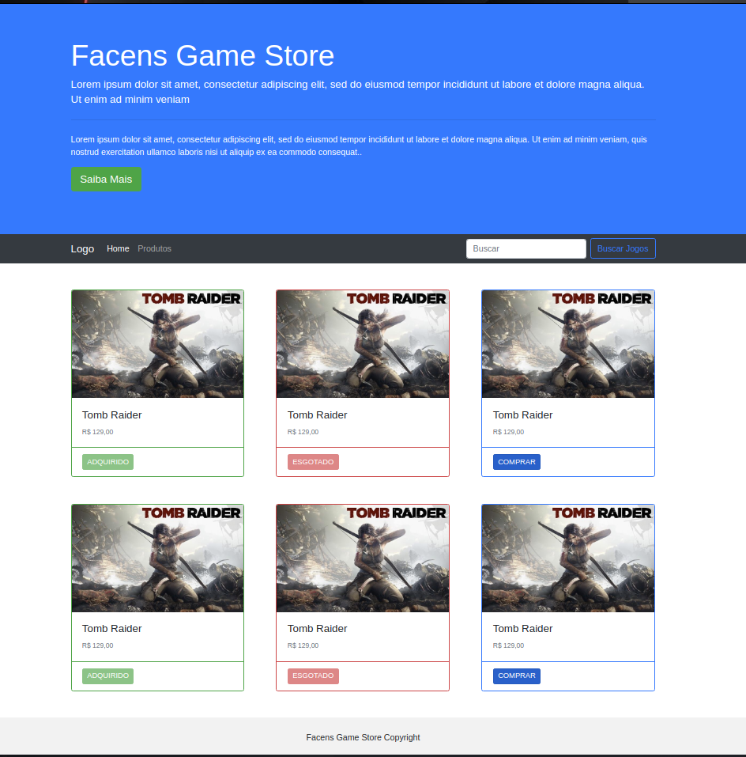
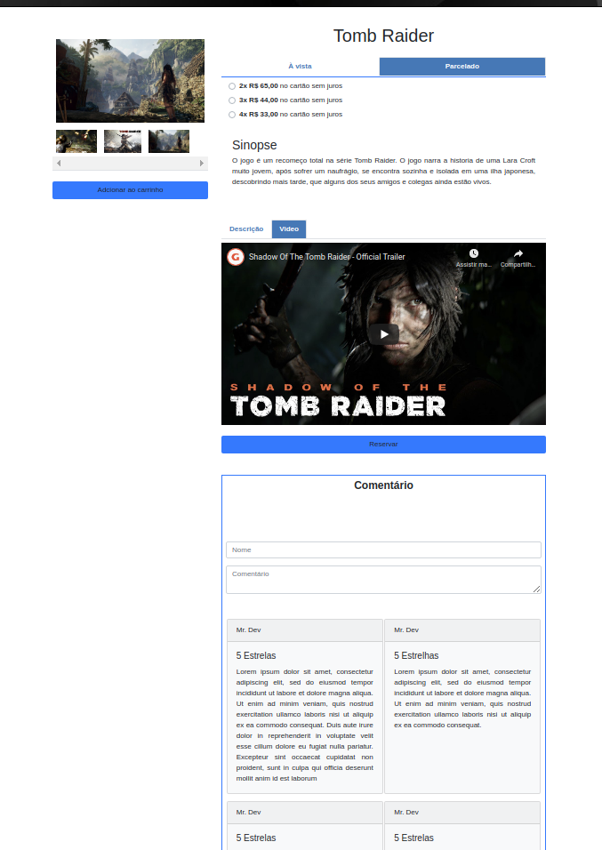

## Exercicio 3

### Código

#### Listagem de Produtos

### HTML

```html
<html lang="en">

<head>
  <title>Faces Game Store</title>
  <meta charset="utf-8">
  <meta name="viewport" content="width=device-width, initial-scale=1">
  <link rel="stylesheet" href="https://cdn.jsdelivr.net/npm/bootstrap@4.6.0/dist/css/bootstrap.min.css"
    integrity="sha384-B0vP5xmATw1+K9KRQjQERJvTumQW0nPEzvF6L/Z6nronJ3oUOFUFpCjEUQouq2+l" crossorigin="anonymous" />
  <link rel="stylesheet" href="./styles/lista.css">
</head>

<body>

  <div class="jumbotron jumbotron-fluid">
    <div class="container">
      <h1 class="display-4">Facens Game Store</h1>
      <p class="lead">Lorem ipsum dolor sit amet, consectetur adipiscing elit, sed do eiusmod tempor incididunt ut
        labore et dolore magna aliqua. Ut enim ad minim veniam</p>
      <hr class="my-4">
      <p>Lorem ipsum dolor sit amet, consectetur adipiscing elit, sed do eiusmod tempor incididunt ut labore et dolore
        magna aliqua. Ut enim ad minim veniam, quis nostrud exercitation ullamco laboris nisi ut aliquip ex ea commodo
        consequat..</p>
      <p class="lead">
        <a class="btn btn-success btn-lg" href="#" role="button">Saiba Mais</a>
      </p>
    </div>
  </div>

  <nav class="navbar navbar-expand-lg navbar-dark bg-dark">
    <div class="container">
      <a class="navbar-brand" href="#">Logo</a>
      <button class="navbar-toggler" type="button" data-toggle="collapse" data-target="#navbarSupportedContent"
        aria-controls="navbarSupportedContent" aria-expanded="false" aria-label="Toggle navigation">
        <span class="navbar-toggler-icon"></span>
      </button>

      <div class="collapse navbar-collapse" id="navbarSupportedContent">
        <ul class="navbar-nav mr-auto">
          <li class="nav-item active">
            <a class="nav-link" href="#">Home <span class="sr-only">(current)</span></a>
          </li>
          <li class="nav-item">
            <a class="nav-link" href="#">Produtos</a>
          </li>
        </ul>
        <form class="form-inline my-2 my-lg-0">
          <input class="form-control mr-sm-2" type="search" placeholder="Buscar" aria-label="Search">
          <button class="btn btn-outline-primary my-2 my-sm-0" type="submit">Buscar Jogos</button>
        </form>
      </div>
    </div>
  </nav>

  <div class="container section">
    <div class="card-deck">
      <div class="row">
        <div class="col-lg-4">
          <div class="card border-success">
            
            <div class="card-body">
              <h5 class="card-title">Tomb Raider</h5>
              <p class="card-text"><small class="text-muted">R$ 129,00</small></p>
            </div>
            <div class="card-footer bg-transparent border-success">
              <a href="#" class="btn btn-success btn-sm active disabled" role="button" aria-pressed="true">ADQUIRIDO</a>
            </div>
          </div>
        </div>
        <div class="col-lg-4">
          <div class="card border-danger">
            
            <div class="card-body">
              <h5 class="card-title">Tomb Raider</h5>
              <p class="card-text"><small class="text-muted">R$ 129,00</small></p>
            </div>
            <div class="card-footer bg-transparent border-danger">
              <a href="#" class="btn btn-danger btn-sm active disabled" role="button" aria-pressed="true">ESGOTADO</a>
            </div>
          </div>
        </div>
        <div class="col-lg-4">
          <div class="card border-primary">
            
            <div class="card-body">
              <h5 class="card-title">Tomb Raider</h5>
              <p class="card-text"><small class="text-muted">R$ 129,00</small></p>
            </div>
            <div class="card-footer bg-transparent border-primary">
              <a href="./produto.html" class="btn btn-primary btn-sm active" role="button" aria-pressed="true">COMPRAR</a>
            </div>
          </div>
        </div>
      </div>
    </div>
  </div>

  <div class="container section">
    <div class="card-deck">
      <div class="row">
        <div class="col-lg-4">
          <div class="card border-success">
            
            <div class="card-body">
              <h5 class="card-title">Tomb Raider</h5>
              <p class="card-text"><small class="text-muted">R$ 129,00</small></p>
            </div>
            <div class="card-footer bg-transparent border-success">
              <a href="#" class="btn btn-success btn-sm active disabled" role="button" aria-pressed="true">ADQUIRIDO</a>
            </div>
          </div>
        </div>
        <div class="col-lg-4">
          <div class="card border-danger">
            
            <div class="card-body">
              <h5 class="card-title">Tomb Raider</h5>
              <p class="card-text"><small class="text-muted">R$ 129,00</small></p>
            </div>
            <div class="card-footer bg-transparent border-danger">
              <a href="#" class="btn btn-danger btn-sm active disabled" role="button" aria-pressed="true">ESGOTADO</a>
            </div>
          </div>
        </div>
        <div class="col-lg-4">
          <div class="card border-primary">
            
            <div class="card-body">
              <h5 class="card-title">Tomb Raider</h5>
              <p class="card-text"><small class="text-muted">R$ 129,00</small></p>
            </div>
            <div class="card-footer bg-transparent border-primary">
              <a href="./produto.html" class="btn btn-primary btn-sm active" role="button" aria-pressed="true">COMPRAR</a>
            </div>
          </div>
        </div>
      </div>
    </div>
  </div>

  <footer class="container-fluid text-center">
    <p>Facens Game Store Copyright</p>
  </footer>

</body>
<script src="https://code.jquery.com/jquery-3.5.1.slim.min.js"
  integrity="sha384-DfXdz2htPH0lsSSs5nCTpuj/zy4C+OGpamoFVy38MVBnE+IbbVYUew+OrCXaRkfj" crossorigin="anonymous">
</script>
<script src="https://cdn.jsdelivr.net/npm/bootstrap@4.6.0/dist/js/bootstrap.bundle.min.js"
  integrity="sha384-Piv4xVNRyMGpqkS2by6br4gNJ7DXjqk09RmUpJ8jgGtD7zP9yug3goQfGII0yAns" crossorigin="anonymous">
</script>

</html>
```

### CSS

```css
.primary {
  color: #fff !important;
  background-color: #337ab7 !important;
  margin-bottom: 0 !important;
}

.section {
  margin-bottom: 50px !important;
}

.navbar {
  margin-bottom: 50px;
  border-radius: 0;
}
 
.jumbotron {
  margin-bottom: 0 !important;
  background-color: #007bff !important;
  color: #fff;
}

footer {
  background-color: #f2f2f2;
  padding: 25px;
}

.panel-body {
  padding: 0 !important;
}

.panel-body img {
  max-height: 170px;
  min-height: 170px;
}

.primary-text {
  color: #337ab7;
  font-weight: bold;
}

.success-text {
  color: #3c763d;
  font-weight: bold;
}

.danger-text {
  color: #a94442;
  font-weight: bold;
}
```

### Pagina de Produto

### HTML

```html
<html lang="en">

<head>
    <meta charset="UTF-8">
    <meta http-equiv="X-UA-Compatible" content="IE=edge">
    <meta name="viewport" content="width=device-width, initial-scale=1.0">
    <meta name="viewport" content="width=device-width, initial-scale=1">
    <link rel="stylesheet" href="https://cdn.jsdelivr.net/npm/bootstrap@4.6.0/dist/css/bootstrap.min.css"
        integrity="sha384-B0vP5xmATw1+K9KRQjQERJvTumQW0nPEzvF6L/Z6nronJ3oUOFUFpCjEUQouq2+l" crossorigin="anonymous">
    <link rel="stylesheet" href="./styles/produto.css">
    <script src="./scripts/produto.js"></script>
    <title>Pagina de Produto</title>
</head>

<body>
    <section class="container">
        <div class="row my-3">
            <div class="col-md-4 mt-5">
                <div class="sticky-top">
                    <div class="w-100  ">
                        <div class="tab-content" id="nav-imageContent">
                            
                            
                            
                        </div>
                        <div style="height:100px;flex-wrap:nowrap; overflow-x:scroll; overflow-y:hidden"
                            class=" d-flex nav nav-tabs" id="nav-image" role="tablist">
                            
                            
                            

                        </div>
                        <div>
                            <button data-toggle="modal" data-target="#" type="button"
                                class="btn btn-block mt-4 bg-primary">
                                Adcionar ao carrinho
                            </button>
                        </div>
                    </div>
                </div>
            </div>
            <div class="col-md-8 text-justify">
                <h1 class="text-center my-4">Tomb Raider</h1>
                <nav>
                    <div class="nav nav-tabs border-primary nav-pills nav-fill" id="nav-tab" role="tablist">
                        <a class="nav-link active" id="nav-power-tab" data-toggle="tab" href="#nav-powder" role="tab"
                            aria-controls="nav-powder" aria-selected="true">À vista</a>
                        <a class="nav-link" id="nav-capsule-tab" data-toggle="tab" href="#nav-capsule" role="tab"
                            aria-controls="nav-capsule" aria-selected="false">Parcelado</a>
                    </div>
                </nav>
                <div class="tab-content mt-2 px-3" id="nav-tabContent">
                    <div class="tab-pane fade show active" id="nav-powder" role="tabpanel"
                        aria-labelledby="nav-home-tab">
                        <div class="form-check custom-control custom-radio mt-2">
                            <input type="radio" class="custom-control-input" name="exampleRadios" id="exampleRadios1"
                                value="d">
                            <label class="form-check-label custom-control-label" for="exampleRadios1">
                                <strong> R$ 129,99 </strong> no cartão ou boleto
                            </label>
                        </div>
                    </div>
                    <div class="tab-pane fade" id="nav-capsule" role="tabpanel" aria-labelledby="nav-profile-tab">
                        <div class="form-check custom-control custom-radio mt-2">
                            <input type="radio" class="custom-control-input" name="exampleRadios1" id="exampleRadios11"
                                value="d">
                            <label class="form-check-label custom-control-label" for="exampleRadios11">
                                <strong> 2x R$ 65,00 </strong> no cartão sem juros
                            </label>
                        </div>
                        <div class="form-check custom-control custom-radio mt-2">
                            <input class="custom-control-input" type="radio" name="exampleRadios1" id="exampleRadios12"
                                value="d">
                            <label class="form-check-label custom-control-label" for="exampleRadios12">
                                <strong> 3x R$ 44,00 </strong> no cartão sem juros
                            </label>
                        </div>
                        <div class="form-check custom-control custom-radio mt-2">
                            <input class="custom-control-input" type="radio" name="exampleRadios1" id="exampleRadios13"
                                value="d">
                            <label class="form-check-label custom-control-label" for="exampleRadios13">
                                <strong> 4x R$ 33,00 </strong> no cartão sem juros
                            </label>
                        </div>
                    </div>
                </div>
                <div class="p-4">
                    <h3 class="mt-3" class="mt-2">
                        Sinopse
                    </h3>
                    <div>
                        O jogo é um recomeço total na série Tomb Raider. O jogo narra a historia de uma Lara Croft muito
                        jovem, após sofrer um naufrágio, se encontra sozinha e isolada em uma ilha japonesa, descobrindo
                        mais tarde, que alguns dos seus amigos e colegas ainda estão vivos.
                    </div>
                </div>
                <div sytle="overflow-x:scroll; overflow-y:hidden;">
                    <div style="flex-wrap:nowrap; overflow-x:scroll; overflow-y:hidden;  -ms-overflow-style: none; scrollbar-width: none;"
                        class=" d-flex nav nav-tabs mt-5" id="nav-dbda" role="tablist">
                        <a class="nav-link active" id="nav-power-tab " style="flex-shrink: 0!important;"
                            data-toggle="tab" href="#nav-description" role="tab" aria-controls="nav-description"
                            aria-selected="true">
                            <div class="">Descrição</div>
                        </a>
                        <a class="nav-link" id="nav-capsule-tab " style="flex-shrink: 0!important;" data-toggle="tab"
                            href="#nav-benefituse" role="tab" aria-controls="nav-benefituse" aria-selected="false">
                            <div> Video </div>
                        </a>
                    </div>
                </div>
                <div style="min-height:200px;" class="tab-content mt-2" id="nav-dbdaContent">
                    <div class="tab-pane fade show active" id="nav-description" role="tabpanel"
                        aria-labelledby="nav-description-tab">
                        <div class="w-full text-base font-normal">
                            Tomb Raider é uma série de jogos eletrônicos, histórias em quadrinhos e filmes tendo como
                            protagonista a personagem Lara Croft. Desde o lançamento do primeiro Tomb Raider, em 1996,
                            as
                            séries tiveram um grande lucro e Lara transformou-se num dos principais ícones da indústria
                            de
                            video-jogos/vídeo games. O Guiness Book reconheceu Lara Croft como "a Melhor Aventureira
                            Heroína
                            do Mundo de video-jogo/vídeo game mais bem sucedida" em 2006.
                        </div>
                    </div>
                    <div class="tab-pane fade show " id="nav-benefituse" role="tabpanel"
                        aria-labelledby="nav-benefituse-tab">
                        <div class="embed-responsive embed-responsive-16by9">
                            <iframe width="560" height="315" src="https://www.youtube.com/embed/XYtyeqVQnRI"
                                title="YouTube video player" frameborder="0"
                                allow="accelerometer; autoplay; clipboard-write; encrypted-media; gyroscope; picture-in-picture"
                                allowfullscreen></iframe>
                        </div>
                    </div>
                </div>
                <a data-toggle="modal" data-target="#enquiry" class="btn btn-block mt-4 mb-2 bg-primary">
                    Reservar
                </a>
                <div class="border border-primary mt-5">
                    <div class="m-2">
                        <h4 class="font-weight-bold  text-center">
                            Comentário
                        </h4>
                        <div class="starrating risingstar d-flex flex-row-reverse justify-content-center">
                            <input type="radio" id="star5" name="rating" value="5" /><label for="star5"
                                title="5 star"></label>
                            <input type="radio" id="star4" name="rating" value="4" /><label for="star4"
                                title="4 star"></label>
                            <input type="radio" id="star3" name="rating" value="3" /><label for="star3"
                                title="3 star"></label>
                            <input type="radio" id="star2" name="rating" value="2" /><label for="star2"
                                title="2 star"></label>
                            <input type="radio" id="star1" name="rating" value="1" /><label for="star1"
                                title="1 star"></label>
                        </div>
                        <div class="d-flex flex-wrap">
                            <input class="form-control my-2" type="text" Placeholder="Nome">
                            <textarea class="form-control my-2" Placeholder="Comentário"></textarea>
                        </div>
                        <div class="d-flex flex-wrap justify-content-around justify-content-center my-auto pt-5">
                            <div class="card bg-light mb-3" style="width:clamp(20rem, 22rem, 100%);">
                                <div class="card-header">Mr. Dev</div>
                                <div class="card-body">
                                    <h5 class="card-title">5 Estrelas</h5>
                                    <p class="card-text">Lorem ipsum dolor sit amet, consectetur adipiscing elit, sed do
                                        eiusmod tempor incididunt ut labore et dolore magna aliqua. Ut enim ad minim
                                        veniam,
                                        quis nostrud exercitation ullamco laboris nisi ut aliquip ex ea commodo
                                        consequat.
                                        Duis aute irure dolor in reprehenderit in voluptate velit esse cillum dolore eu
                                        fugiat nulla pariatur. Excepteur sint occaecat cupidatat non proident, sunt in
                                        culpa
                                        qui officia deserunt mollit anim id est laborum</p>
                                </div>
                            </div>
                            <div class="card bg-light mb-3" style="width:clamp(20rem, 22rem, 100%);">
                                <div class="card-header">Mr. Dev</div>
                                <div class="card-body">
                                    <h5 class="card-title">5 Estrelhas</h5>
                                    <p class="card-text">
                                        Lorem ipsum dolor sit amet, consectetur adipiscing elit, sed do eiusmod tempor
                                        incididunt ut labore et dolore magna aliqua. Ut enim ad minim veniam, quis
                                        nostrud
                                        exercitation ullamco laboris nisi ut aliquip ex ea commodo consequat.
                                    </p>
                                </div>
                            </div>
                            <div class="card bg-light mb-3" style="width:clamp(20rem, 22rem, 100%);">
                                <div class="card-header">Mr. Dev</div>
                                <div class="card-body">
                                    <h5 class="card-title">5 Estrelas</h5>
                                    <p class="card-text">
                                        Lorem ipsum dolor sit amet, consectetur adipiscing elit, sed do eiusmod tempor
                                        incididunt ut labore et dolore magna aliqua.
                                    </p>
                                </div>
                            </div>
                            <div class="card bg-light mb-3" style="width:clamp(20rem, 22rem, 100%);">
                                <div class="card-header">Mr. Dev</div>
                                <div class="card-body">
                                    <h5 class="card-title">5 Estrelas</h5>
                                    <p class="card-text">
                                        Lorem ipsum dolor sit amet, consectetur adipiscing elit, sed do eiusmod tempor
                                        incididunt ut labore et dolore magna aliqua.
                                    </p>
                                </div>
                            </div>
                            <div class="card bg-light mb-3" style="width:clamp(20rem, 22rem, 100%);">
                                <div class="card-header">Mr. Dev</div>
                                <div class="card-body">
                                    <h5 class="card-title">5 Estrelas</h5>
                                    <p class="card-text">
                                        Lorem ipsum dolor sit amet, consectetur adipiscing elit, sed do eiusmod tempor
                                        incididunt ut labore et dolore magna aliqua. Ut enim ad minim veniam, quis
                                        nostrud
                                        exercitation ullamco laboris nisi ut aliquip ex ea commodo consequat. Duis aute
                                        irure dolor in reprehenderit in voluptate velit esse cillum dolore eu fugiat
                                        nulla
                                        pariatur. Excepteur sint occaecat cupidatat non proident, sunt in culpa qui
                                        officia
                                        deserunt mollit anim id est laborum
                                    </p>
                                </div>
                            </div>
                        </div>
                    </div>
                </div>
            </div>
        </div>
        </div>
    </section>
    <div class="modal fade" id="enquiry" tabindex="-1" role="dialog" aria-labelledby="enquiryLabel" aria-hidden="true">
        <div class="modal-dialog" role="document">
            <div class="modal-content">
                <form>
                    <div class="modal-header">
                        <h5 class="modal-title" id="enquiryLabel">Avise-me quando chegar</h5>
                        <button type="button" class="close" data-dismiss="modal" aria-label="Close">
                            <span aria-hidden="true">&times;</span>
                        </button>
                    </div>
                    <div class="modal-body">
                        <form>
                            <div class="form-group row">
                                <label for="inputEmail3" class="col-sm-2 col-form-label">Email</label>
                                <div class="col-sm-10">
                                    <input type="email" class="form-control" id="inputEmail3">
                                </div>
                            </div>
                            <div class="form-group row">
                                <label for="phone" class="col-sm-2 col-form-label">Telefone</label>
                                <div class="col-sm-10">
                                    <input type="type" class="form-control" id="inputPhone3" pattern="[0-9]{10}">
                                </div>
                            </div>
                        </form>
                    </div>
                    <div class="modal-footer">
                        <button type="button" class="btn btn-secondary" data-dismiss="modal">Fechar</button>
                        <button type="submit" type="button" class="btn btn-primary bg-primary">Enviar</button>
                    </div>
                </form>
            </div>
        </div>
    </div>
</body>
<script src="https://code.jquery.com/jquery-3.5.1.slim.min.js"
    integrity="sha384-DfXdz2htPH0lsSSs5nCTpuj/zy4C+OGpamoFVy38MVBnE+IbbVYUew+OrCXaRkfj" crossorigin="anonymous">
</script>
<script src="https://cdn.jsdelivr.net/npm/bootstrap@4.6.0/dist/js/bootstrap.bundle.min.js"
    integrity="sha384-Piv4xVNRyMGpqkS2by6br4gNJ7DXjqk09RmUpJ8jgGtD7zP9yug3goQfGII0yAns" crossorigin="anonymous">
</script>

</html>
```

### CSS

```css
@import url(//netdna.bootstrapcdn.com/font-awesome/3.2.1/css/font-awesome.css);
.nav-link.active {
  background-color: #337ab7 !important;
  color: #fff !important;
}
#nav-dbda::-webkit-scrollbar {
  display: none;
}
.nav-link {
  color: #337ab7 !important;
  font-weight: bolder;
}
.modal{
  padding:0!important;
}
.modal-xl {
  height: clamp(60%, 1000px, 80%);
}
.active.btn {
  background: #337ab7 !important;
}
.prepaid .active.btn {
  background: #337ab7 !important;
}
.starrating > input {display: none;}  /* Remove radio buttons */

.starrating > label:before { 
  content: "\f005"; /* Star */
  margin: 2px;
  font-size: 3.5em;
  font-family: FontAwesome;
  display: inline-block; 
}

.starrating > label {
  color: #222222; 
}


.starrating > input:checked ~ label
{ color: #337ab7 ; } 

.starrating > input:hover ~ label
{ color: #337ab7 ;  }


@media (max-width: 990px) and (min-width: 768px) {
  .modal-xl {
    max-width: 750px!important;
  }
}

```

### JavaScript

```javascript
$("[name='pay']").click(function  (){
  let x = $(this).val();
  if(x == 0){
    $('.prepaid').addClass('d-flex');
  }
  else{
      $('.prepaid').removeClass('d-flex');
    
  }
});
```

### Prints


