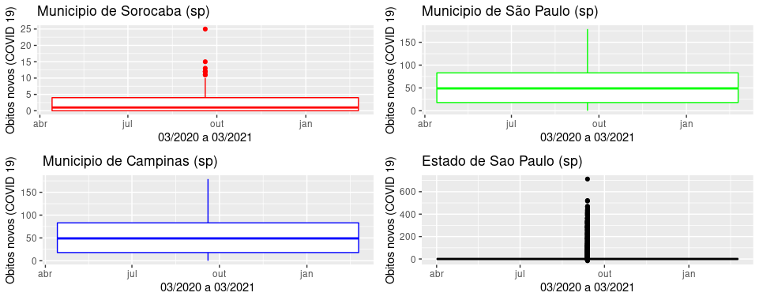
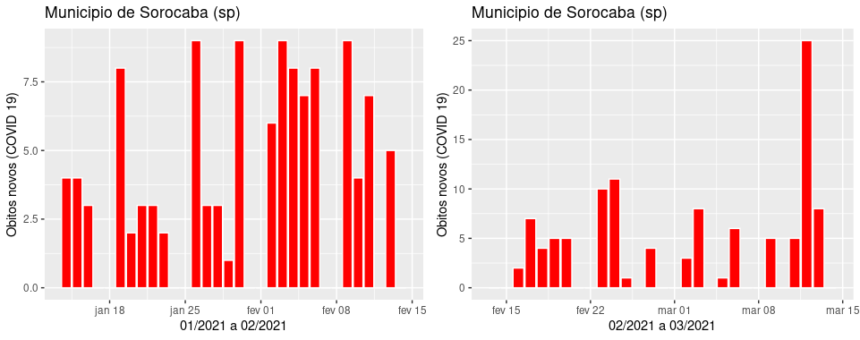

#  Análise exploratória de dados (Covid)

## Base de dados utilizada

[Base de dados nacional do Covid 19](https://covid.saude.gov.br)


### Analise dos municipios e do estado de São Paulo.



### Analise do municipio de Sorocaba (Sp)



### Codigo utilizado

```R
## Analise exploratoria dados (COVID 19)

library(dplyr)
library(lubridate)
library(ggplot2)
library(plotly)
library(gridExtra)

## CARREGANDO A BASE DE DADOS ...
database <- read.csv("~/studyspace/facens/estatistica/databases/HIST_PAINEL_COVIDBR_10mai2021.csv", sep=";")

head(database)
tail(database)
dim(database)

class(database$data)
database$data <- as.Date(database$data, format= "%Y-%m-%d")
class(database$data)

## SOROCABA

sorocaba <- database %>% filter(municipio == "Sorocaba", data >= as.Date("2020-03-14"), 
                     data <=as.Date("2021-03-14") ) %>% select(data,obitosNovos)

BpSorocaba <- ggplot(sorocabaBp) +
  aes(data,obitosNovos) +
  geom_boxplot(color="red") +
  labs(x = "03/2020 a 03/2021", y="Obitos novos (COVID 19)", title = "Municipio de Sorocaba (sp)")

## SAO PAULO

saoPaulo <- database %>% filter(municipio == "São Paulo", data >= as.Date("2020-03-14"), 
                                data <=as.Date("2021-03-14") ) %>% select(data,obitosNovos)

BpSaoPaulo <- ggplot(saoPaulo) +
  aes(data,obitosNovos) +
  geom_boxplot(color="green") +
  labs(x = "03/2020 a 03/2021", y="Obitos novos (COVID 19)", title = "Municipio de São Paulo (sp)")


## CAMPINAS

campinas <- database %>% filter(municipio == "São Paulo", data >= as.Date("2020-03-14"), 
                                data <=as.Date("2021-03-14") ) %>% select(data,obitosNovos)

BpCampinas <- ggplot(campinas) +
  aes(data,obitosNovos) +
  geom_boxplot(color="blue") +
  labs(x = "03/2020 a 03/2021", y="Obitos novos (COVID 19)", title = "Municipio de Campinas (sp)")


## ESTADO SAO PAULO

estadoSp <- database %>% filter(estado == "SP", data >= as.Date("2020-03-14"), 
                                data <=as.Date("2021-03-14") ) %>% select(data,obitosNovos)

BpEstadoSp <- ggplot(estadoSp) +
  aes(data,obitosNovos) +
  geom_boxplot(color="black") +
  labs(x = "03/2020 a 03/2021", y="Obitos novos (COVID 19)", title = "Estado de Sao Paulo (sp)")


grid.arrange(BpSorocaba, BpSaoPaulo, BpCampinas, BpEstadoSp, ncol=2, nrow=2)


## HISTOGRAMA - SOROCABA

## Periodo 1

sorocabaData1 <- database %>% filter(municipio == "Sorocaba", data >= as.Date("2021-01-14"), 
                                data <=as.Date("2021-02-14") ) %>% select(data,obitosNovos)


col1Sorocaba <- ggplot(sorocabaData1) +
  aes(data,obitosNovos) +
  geom_col(fill="red", color="white") +
  labs(x = "01/2021 a 02/2021", y="Obitos novos (COVID 19)", title = "Municipio de Sorocaba (sp)")


## Periodo 2

sorocabaData2 <- database %>% filter(municipio == "Sorocaba", data >= as.Date("2021-02-14"), 
                                     data <=as.Date("2021-03-14") ) %>% select(data,obitosNovos)


col2Sorocaba <- ggplot(sorocabaData2) +
  aes(data,obitosNovos) +
  geom_col(fill="red", color="white") +
  labs(x = "02/2021 a 03/2021", y="Obitos novos (COVID 19)", title = "Municipio de Sorocaba (sp)")


grid.arrange(col1Sorocaba, col2Sorocaba, ncol=2, nrow=1)
```