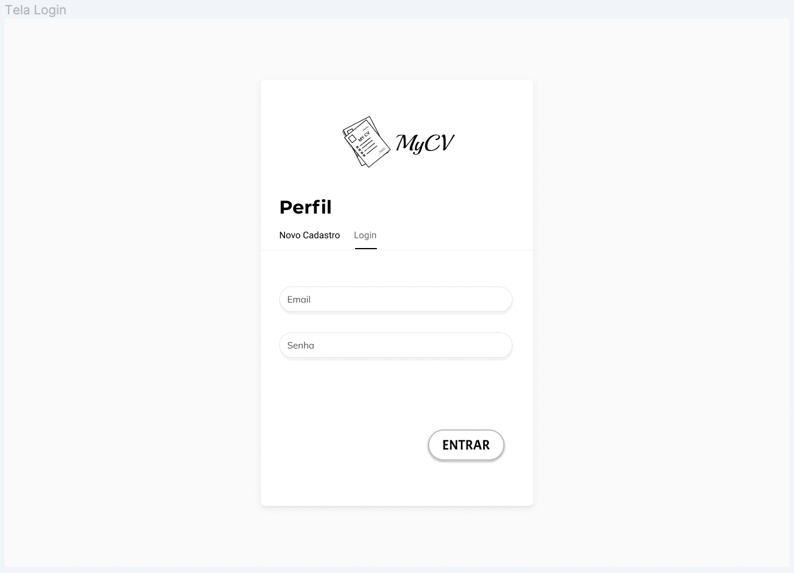
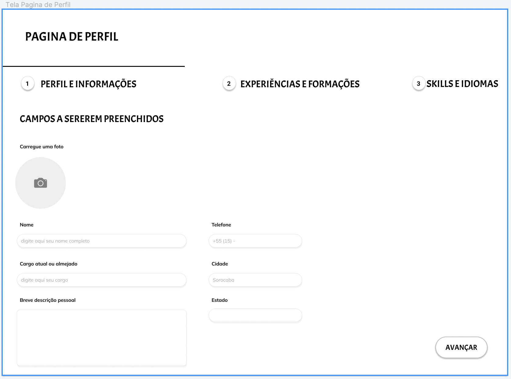
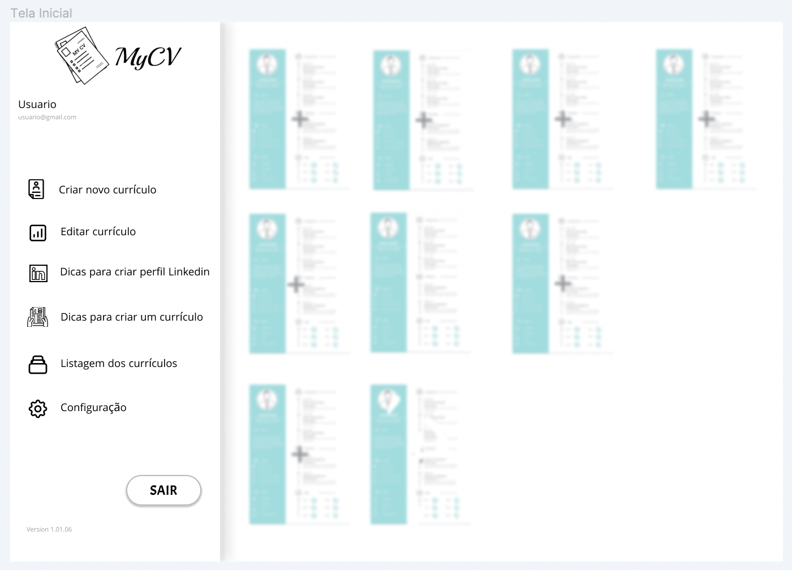

# Projeto - MyCV

Projeto desenvolvido para Fabrica de de Projetos 1/2022.

Tem como objetivo criar uma plataforma simplificada de criação de curriculos.

---

### Design

---

### Front

- Desenvolvido com NextJS

---

### Back

- Desenvolvido com NodeJS e MongoDB

---

## License

Copyright © 2021, [Grupo Gamer Zone](https://github.com/gabrielDpadua21).
Released under the [MIT license](LICENSE).