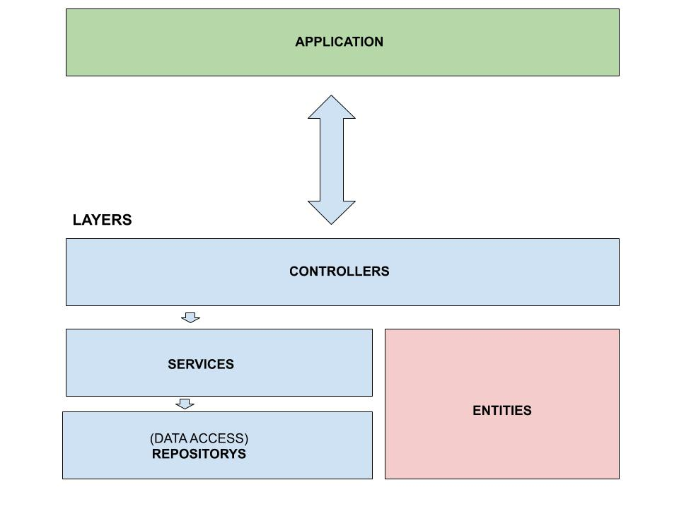
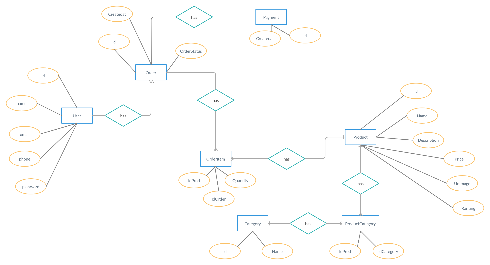
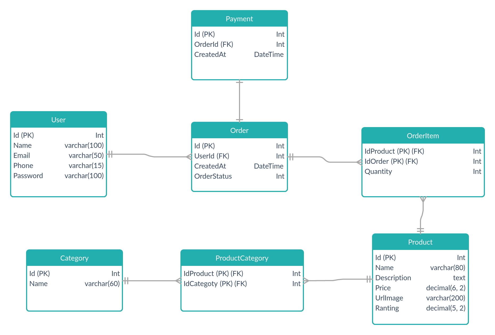
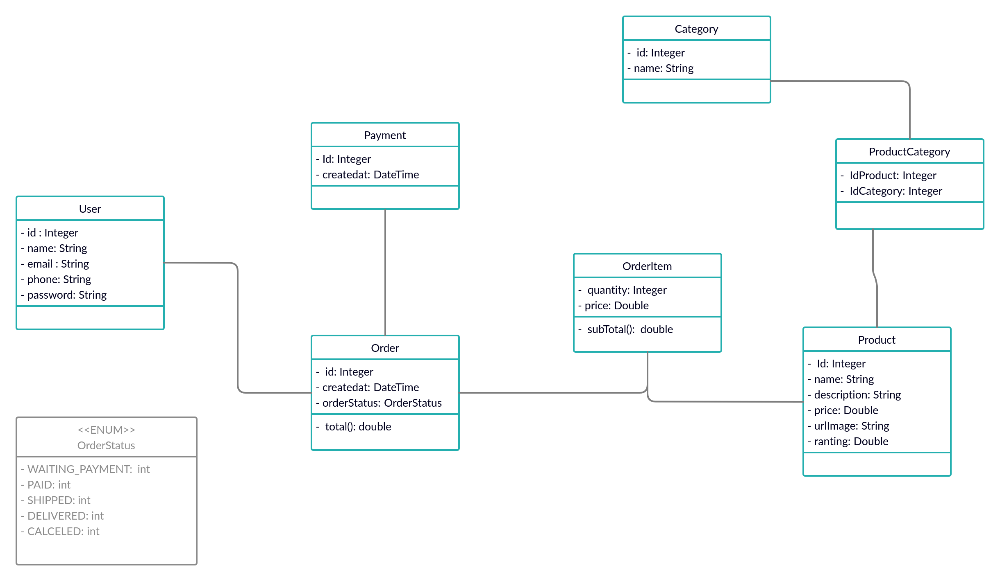

# Project Facens Game Store 

### Web Development Archteture

> 
![JAVA VERSION][java-image]

---

## Description

The facens game store is a digital games store that brings together the best content from the desktop and mobile world

---

## Technologies

---

## Status Project

- Finished

---

## Features
- [x] User
- [x] Product
- [x] Category
- [x] Order
- [x] Payment
- [x] Login
- [x] Authentication
- [x] Security
- [ ] Deploy

---

## Architecture

---

## DER

---

## Logic Model

---

## Class Diagram

#### License

Copyright © 2022, [Gabriel D. Padua](https://github.com/gabrielDpadua21).
Released under the [MIT license](LICENSE).

***

<!-- Markdown link & img dfn's -->
[java-image]:https://img.shields.io/badge/java-v%2011-red
