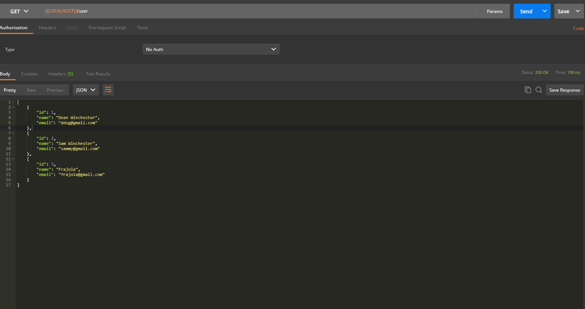

# Projeto Exercicio 01 (Arquitetura web) - Spring api com JPA

> 
![JAVA VERSION][java-image]
---

## Descrição

Projeto spring web, API de cadastro de usuários com jpa e banco de dados h2.

---

### API

#### GET ALL

#### GET BY ID

#### INSERT

#### UPDATE

#### DELETE

#### AUTH

---

## Técnologias

---

### Licença

Copyright © 2021, [Gabriel D. Padua](https://github.com/gabrielDpadua21).
Released under the [MIT license](LICENSE).

***

<!-- Markdown link & img dfn's -->
[java-image]:https://img.shields.io/badge/java-v%2011-red