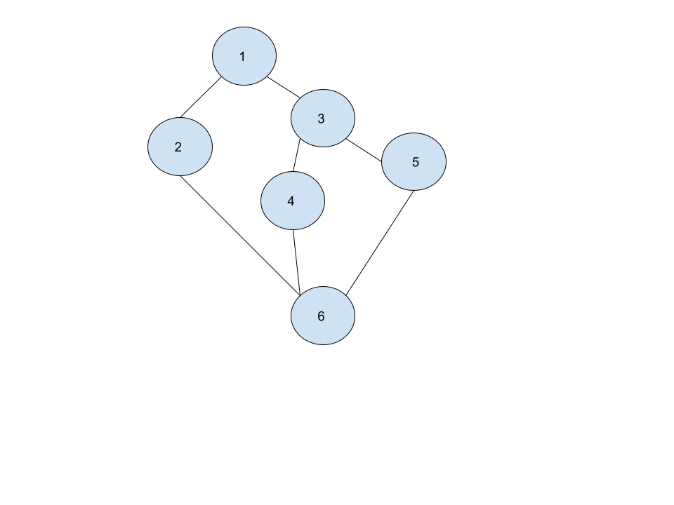

# Qualidade de Código e complexidade ciclomática

---

## Estudo de Caso

**Regra de Negócio**: Idade de contratação de um funcionário: A empresa não contrata pessoas com idade inferior da 16 anos. Caso a pessoa tenha 16 anos até 18, ela pode ser contratada apenas em tempo parcial. Se a pessoa tiver de 18 a 55 anos, ela poderá ser contratada em período integral. Pessoas com idade superior a 55 não serão contratadas.

## Análise da complexidade ciclomática do código e cobertura de testes

### Grafo de fluxo



## Calcular a complexidade cliclomática

1) Número de regiões = 3

2) V(G) = 7 ramos - 6 nós + 2 = 3

3) V(G) = 2 nós predicativos + 1 = 3

## Número de caminhos básicos independes

1) 1-2-6

2) 3-4-6

3) 5-6


---

### Técnologias utilizadas


---

## Rodando projeto

- Requisitos: NodeJS 12+

### Instalando as dependências

```shell
$ yarn
```

### Rodando os testes

```shell
$ yarn test
```

---

### License

Copyright © 2021, [Gabriel D. Padua](https://github.com/gabrielDpadua21).
Released under the [MIT license](LICENSE).